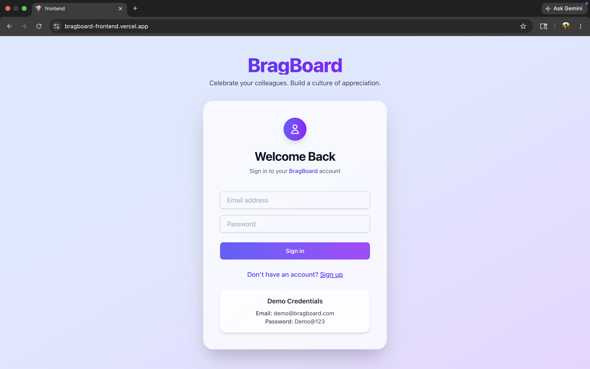
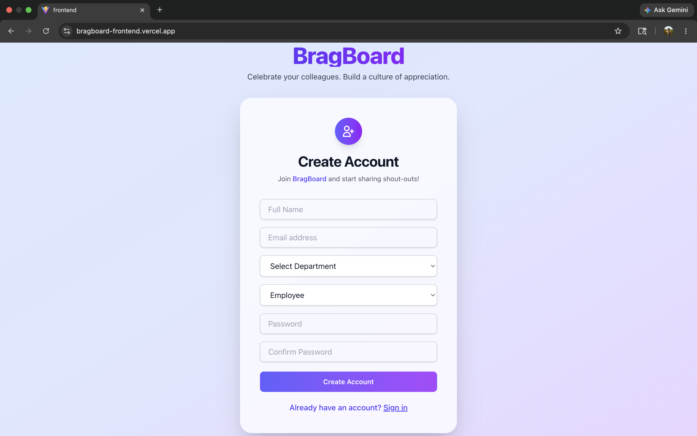
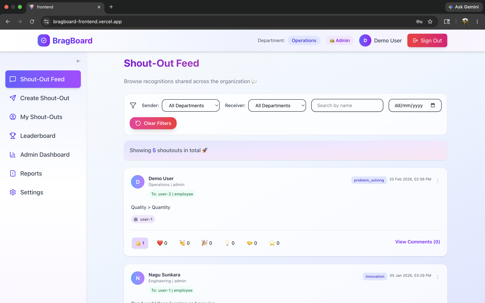
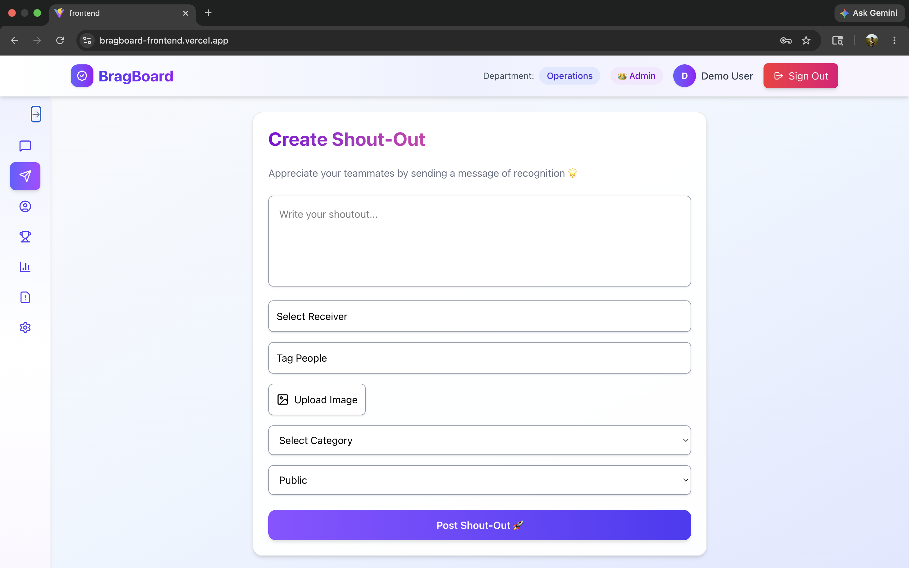
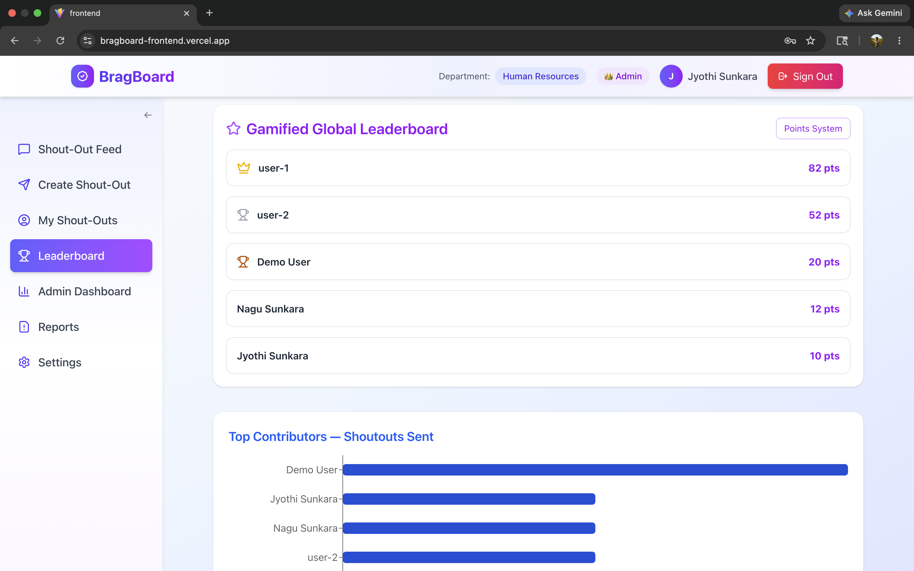
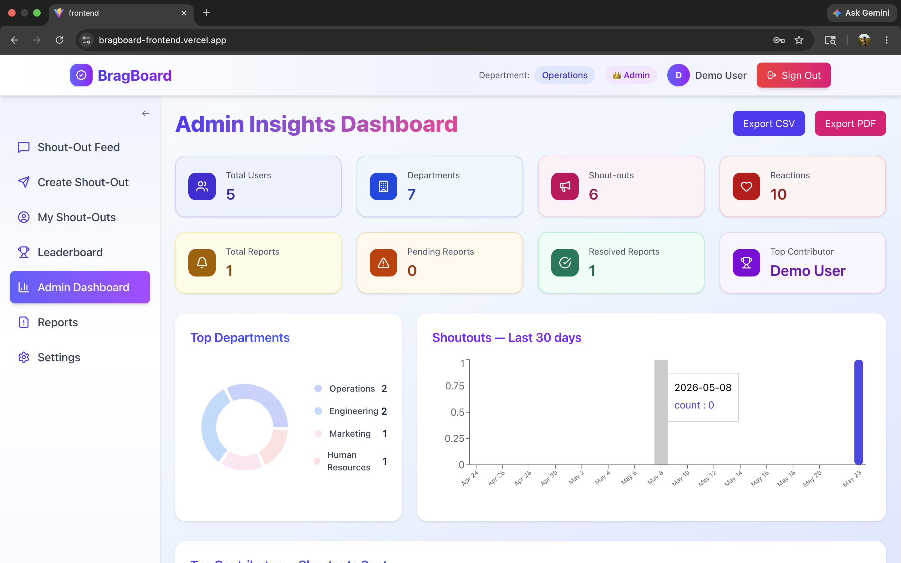
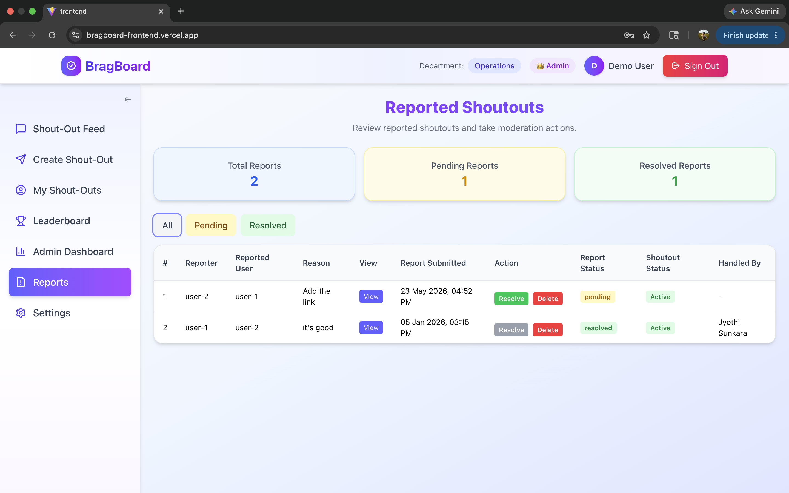
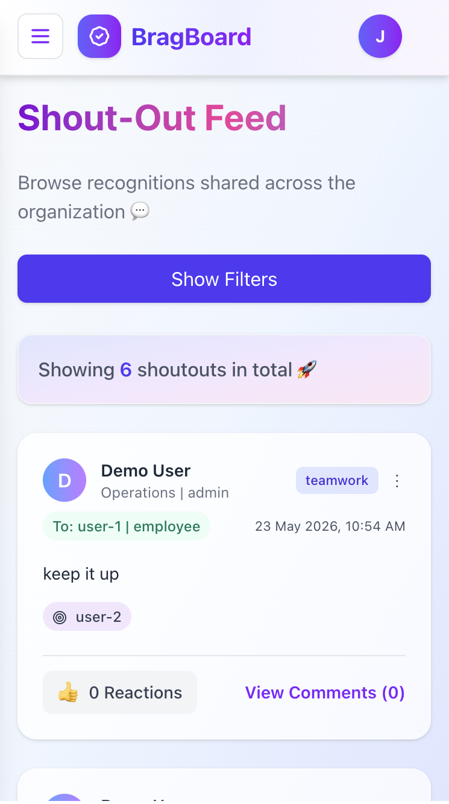
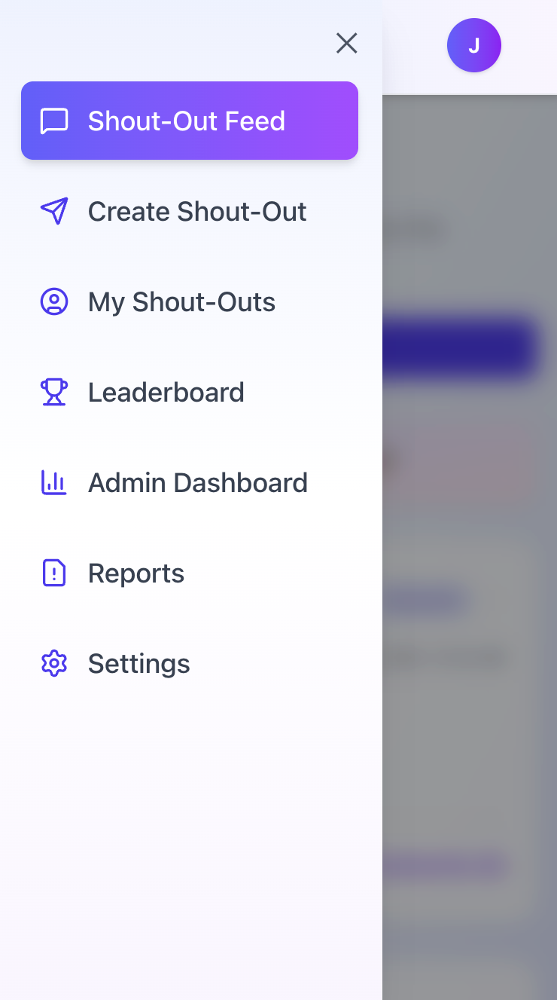
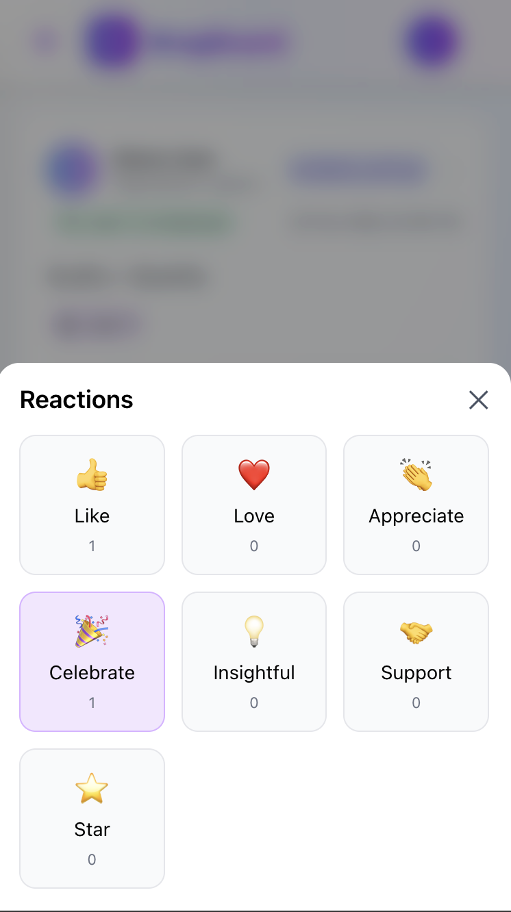

# BragBoard 🎉


Built with React, FastAPI, PostgreSQL, and Tailwind CSS, BragBoard is an internal employee recognition platform that encourages appreciation and engagement within organizations through shout-outs, reactions, comments, achievements, and leaderboards.

---

## 🚀 Live Demo

https://bragboard-frontend.vercel.app/

---

## ✨ Features

- JWT Authentication (Access + Refresh Tokens)
- User Registration & Login
- Department-wise user management
- Role-based access control
- Create and manage shout-outs
- Multi-user tagging support
- Like, Clap, and Star reactions
- Commenting system for shout-outs
- Real-time feed updates
- Department and date filtering
- Achievement tracking
- Employee leaderboard system
- Admin dashboard analytics
- Report moderation system
- Delete inappropriate posts/comments
- Responsive mobile UI
- Image upload support

---

## 🛠️ Tech Stack

### Frontend

- React.js
- Tailwind CSS
- Axios
- React Router
- Vite

### Backend

- FastAPI
- PostgreSQL
- SQLAlchemy
- JWT Authentication

---

## 🏆 Admin Dashboard Features

- Top contributors tracking
- Most tagged employees
- Moderation tools
- Reports management
- Employee engagement analytics
- Leaderboard insights

---

## 📸 Screenshots

### Login Page

<p align="center">
  
</p>

---

### Register Page

<p align="center">
  
</p>

---

## 📢 Feed & Shout-Out System

### Shout-Out Feed

<p align="center">
  
</p>

### Create Shout-Out Form

<p align="center">
  
</p>

---

## 🏆 Gamification

### Leaderboard

<p align="center">
  
</p>

---

## 🛡️ Admin Features

### Admin Dashboard

<p align="center">
  
</p>

### Reports

<p align="center">
  
</p>

---

## 📱 Mobile Responsive UI

<p align="center">
  
  
</p>

<br/>

<p align="center">
  
</p>

---

## ⚙️ Installation

### Clone Repository

```bash
git clone https://github.com/JyothiSunkara/Jyothi_BragBoard.git
cd Jyothi_BragBoard
```

---

## 💻 Frontend Setup

```bash
cd frontend
npm install
npm run dev
```

Frontend runs on:

```bash
http://localhost:5173
```

---

## 🔧 Backend Setup

```bash
cd backend
pip install -r requirements.txt
uvicorn main:app --reload
```

Backend runs on:

```bash
http://127.0.0.1:8000
```

---

## 🔑 Environment Variables

Create a `.env` file inside backend:

```env
DATABASE_URL=your_postgresql_database_url
SECRET_KEY=your_secret_key
ALGORITHM=HS256
ACCESS_TOKEN_EXPIRE_MINUTES=30
```

---

## 🏗️ Project Structure

```txt
Jyothi_BragBoard/
│
├── backend/
│   ├── main.py
│   ├── config.py
│   ├── database.py
│   ├── database_models.py
│   ├── schemas.py
│   ├── auth.py
│   ├── check_db.py
│   │
│   ├── routers/
│   │   ├── users.py
│   │   ├── shoutouts.py
│   │   ├── reactions.py
│   │   ├── achievements.py
│   │   ├── admins.py
│   │   └── comments.py
│   │
│   ├── uploads/
│   ├── requirements.txt
│   └── .env
│
├── frontend/
│   ├── src/
│   │   ├── components/
│   │   │
│   │   │ ├── auth/
│   │   │ │   ├── Auth.jsx
│   │   │ │   ├── Login.jsx
│   │   │ │   └── Register.jsx
│   │   │
│   │   │ ├── dashboard/
│   │   │ │   ├── Dashboard.jsx
│   │   │ │   ├── Header.jsx
│   │   │ │   ├── Sidebar.jsx
│   │   │ │   ├── Settings.jsx
│   │   │ │   ├── MainContent.jsx
│   │   │ │   ├── Leaderboard.jsx
│   │   │ │   └── Achievements.jsx
│   │   │
│   │   │ ├── shoutouts/
│   │   │ │   ├── ShoutOutFeed.jsx
│   │   │ │   ├── ShoutOutForm.jsx
│   │   │ │   ├── ShoutOutPage.jsx
│   │   │ │   ├── MyShoutOuts.jsx
│   │   │ │   ├── EditShoutOut.jsx
│   │   │ │   ├── ReactionBar.jsx
│   │   │ │   ├── ReportShoutOut.jsx
│   │   │ │   └── CommentsSection.jsx
│   │   │
│   │   │ ├── admin/
│   │   │ │   ├── AdminBoard.jsx
│   │   │ │   └── Reports.jsx
│   │
│   │   ├── services/
│   │   │   └── api.js
│   │
│   │   ├── App.jsx
│   │   └── index.css
│   │
│   ├── package.json
│   ├── vite.config.js
│   └── tailwind.config.js
│
├── screenshots/
│   ├── login.png
│   ├── register.png
│   ├── feed.png
│   ├── form.png
│   ├── leaderboard.png
│   ├── admin-dashboard.png
│   ├── reports.png
│   ├── mobile-feed.png
│   ├── mobile-sidebar.png
│   └── mobile-reactions.png
│
├── .gitignore
├── PROJECT_DOCUMENTATION.md
└── README.md
```

---

## 🎯 Project Outcomes

- JWT-authenticated employee login system
- Interactive shout-out feed
- Employee engagement through reactions and comments
- Admin moderation system
- Leaderboard and achievements tracking
- Mobile responsive UI
- Full-stack deployment experience

---

## 📚 Learning Outcomes

Through this project, I gained hands-on experience in:

- Full-stack application development
- REST API development with FastAPI
- JWT authentication workflows
- PostgreSQL database integration
- Responsive UI design using Tailwind CSS
- React component architecture
- Backend routing and modularization
- Deployment and production configuration

---

## 🔮 Future Improvements

- Real-time notifications
- WebSocket integration
- Advanced analytics dashboards
- Email notifications
- Dark mode support
- Team-based leaderboards
- Profile customization

---

## 👩‍💻 Author

### Jyothi Sunkara

- GitHub: https://github.com/JyothiSunkara
- Project Repository: https://github.com/JyothiSunkara/Jyothi_BragBoard

---

## ⭐ Acknowledgements

Developed during the Infosys Springboard Full-Stack Development Internship.
